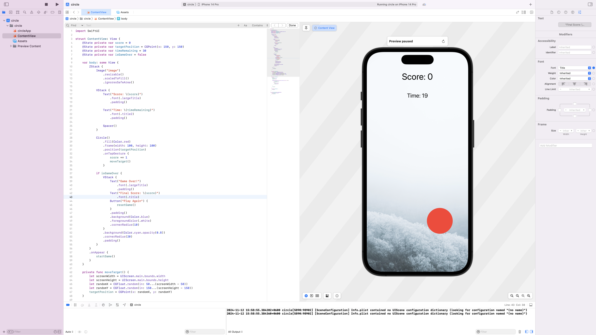
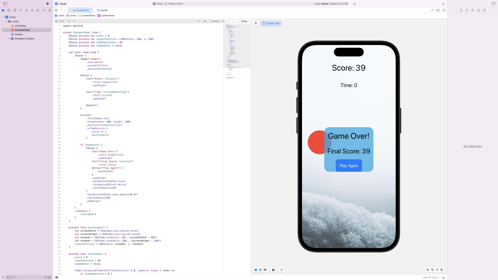
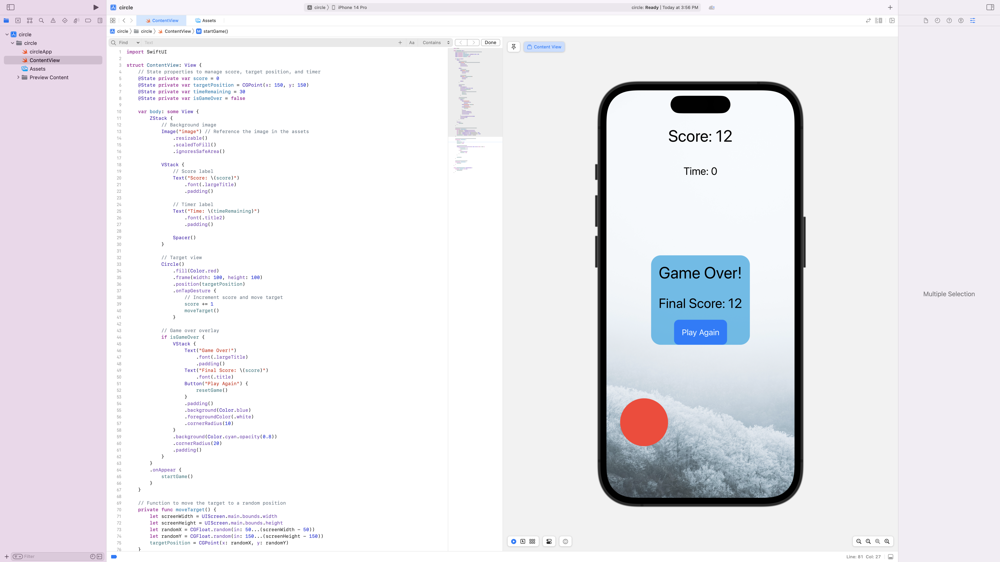

# Media Folder

This repository contains a collection of media files, including images and a video, stored in the `media` folder.

## Preview

Here’s a quick preview of the contents in the `media` folder:

### Images

Below are the images included in this repository:






### Video

To view the video, click the link below to watch it on YouTube:

[](https://youtube.com/shorts/e9gd2gOxsDE?feature=share) *(click to watch)*

## How to Use

1. Clone this repository:
   ```bash
   git clone https://github.com/your-username/media-folder.git
